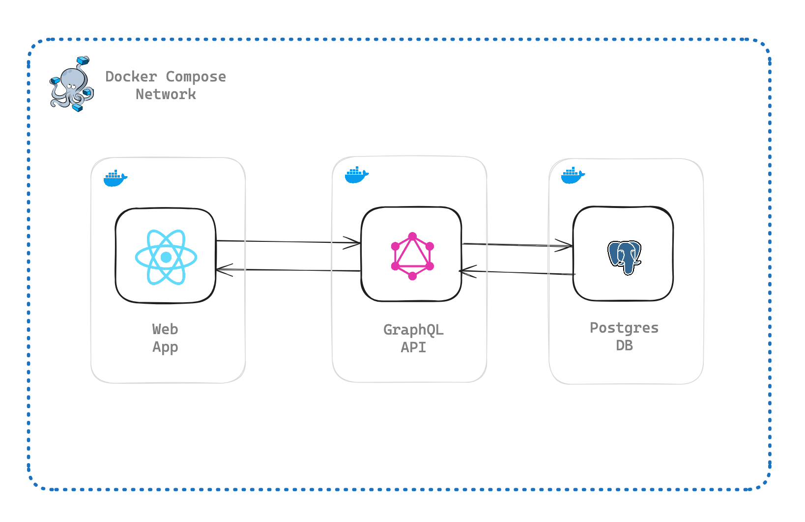

# Weird Salads
Monorepo containing source code for Weird Salads inventory app and API

## Tech
### Tooling
* [Turbo](https://turbo.build/)
* Docker
* TypeScript
* Prettier/ESLint

## Web App
* [Vite](https://vitejs.dev/)
* [React](https://react.dev/)

## API
* [Express](https://expressjs.com/)
* [Postgraphile](https://www.graphile.org/postgraphile/)
* [Sequelize](https://sequelize.org/)/[Umzug](https://github.com/sequelize/umzug)

## Database
* PostgreSQL

### On-location deployment
